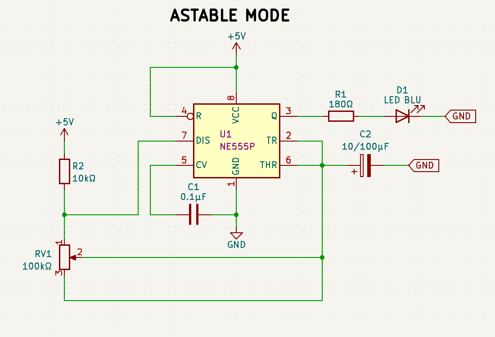
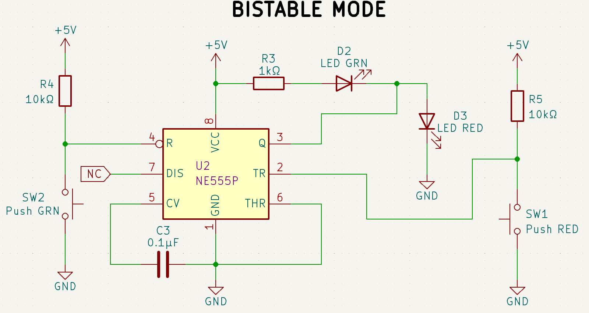
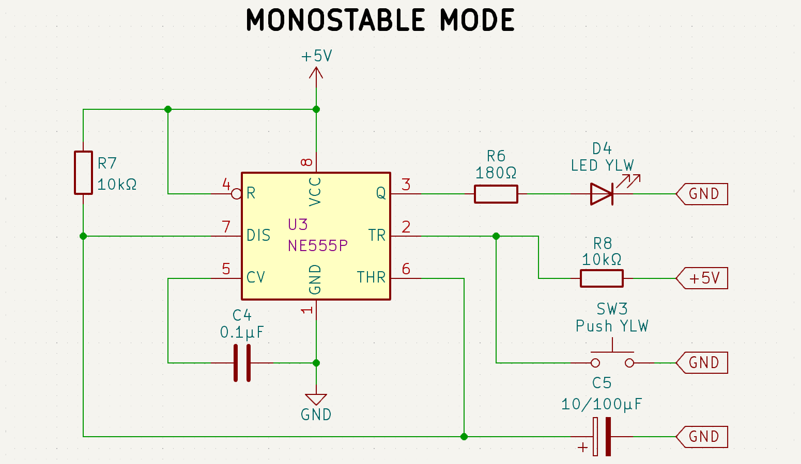

# The 555 Timer Medley: Astable, Bistable, and Monostable Configurations
The 555 timer is a versatile and widely used integrated circuit that consists of two voltage comparators,
a flip-flop, a discharge transistor, and a voltage divider network made up of three 5kΩ resistors
(hence the name "555"). The voltage divider is configured to set up a reference voltage at one-third and two-thirds
of the supply voltage.

The comparators monitor the input signals from the external circuit and compare them to these reference levels.
Based on the results, the flip-flop changes state, controlling the **output** (pin 3). 

When the voltage at the **trigger** pin (pin 2) drops below one-third of the supply voltage, the flip-flop is set,
turning the output HIGH.

Conversely, when the **threshold** pin (pin 6) detects a voltage above two-thirds of the supply voltage,
the flip-flop resets, making the output LOW.

The **discharge transistor** (pin 7) is used to discharge an external capacitor,
controlling the timing intervals in astable and monostable configuratons.

## Video Demonstration

## Astable Configuration

In this mode, the 555 Timer is configured as an oscillator, continuously cycling between high and low output states,
essentially creating a square wave.

### Circuit Schematic:

### Circuit Components & Wiring:

1. Pin 1 to GND.
2. Pin 2 to Pin 6
3. Pin 3 goes through a 180Ω resistor and a blue LED in series to GND.
4. Pin 4 to +5V.
5. Pin 5 goes through a 0.1 µF capacitor in series to GND.
6. Pin 6 goes through a 10µF or 100µF capacitor in series to GND.
7. Pin 7 is connected between the 10kΩ resistor and the potentiometer in a voltage divider configuration.
8. Pin 8 to VCC (+5V, in this case).
9. The wiper of the potentiometer connects to Pin 2 and Pin 6.
10. The positive terminal of the potentiometer goes through a 10kΩ resistor to +5V.

### Operation:

The 555 Timer in Astable Mode continuously toggles between high and low states, causing the blue LED to blink at a rate
controlled by the potentiometer. Adjusting the potentiometer changes the frequency of oscillation,
effectively controlling the blinking rate of the LED.

### Applications:
- Square wave generation
- Clock pulses for digital circuits
- Flashing LED circuits. 

## Bistable Configuration

In this mode, the 555 Timer is used as a flip-flop, toggling between two solid stable states based on external inputs.

### Circuit Schematic:

### Circuit Components & Wiring:

1. Pin 1 to GND.
2. Pin 2 connects between:
* A 10kΩ pull-up resistor to +5V.
* A pushbutton switch to GND.
3. Pin 3 connects between the cathode of a green LED and the anode of a red LED.
* The green LED anode is connected to +5V through a 1kΩ resistor.
* The red LED cathode is connected to GND.
4. Pin 4 is connected similarly to Pin 2, with:
* A 10kΩ pull-up resistor to +5V.
* A pushbutton switch to GND.
5. Pin 5 goes through a 0.1 µF capacitor in series to GND.
6. Pin 6 goes through a 10µF or 100µF capacitor in series to GND.
7. Pin 7 is not connected
8. Pin 8 to VCC (+5V, in this case).

### Operation:

The 555 Timer in Bistable Mode allows the circuit to toggle between two solid stable states. Pressing the first
pushbutton connected to Pin 2 sets the output to HIGH, lighting up the green LED. Pressing the second pushbutton
connected to Pin 4 resets the output to LOW, lighting up the red LED.

### Applications:
- Toggle switches
- Memory elements in digital circuits
- Simple flip-flop circuits

## Monostable Configuration

In this mode, the 555 Timer is configured to generate a single pulse of a fixed duration when triggered.

### Circuit Schematic:

### Circuit Components & Wiring:

1. Pin 1 to GND.
2. Pin 2 connects between:
* A 10kΩ pull-up resistor to +5V.
* A pushbutton switch to GND.
3. Pin 3 goes through a 180Ω resistor and a yellow LED in series to GND.
4. Pin 4 to VCC (+5V, in this case).
5. Pin 5 goes through a 0.1 µF capacitor in series to GND.
6. Pin 6 and Pin 7 connect after a 10kΩ resistor to +5V on one side and to a 10µF or 100µF capacitor to GND on the
other.
7. Pin 8 to VCC (+5V, in this case).

### Operation:

The 555 Timer in Monostable Mode generates a pulse when the pushbutton is pressed, where the output goes HIGH,
lighting up the yellow LED for a duration determined by the capacitor and resistor values. Once the timer completes its
cycle, the output returns to LOW, and the LED turns off.

### Applications:
- Single-pulse generators
- Debouncing switches
- Delay circuits

## Author

[th0tmaker](https://github.com/th0tmaker) - *"makeshift developer and maker of thots!"*