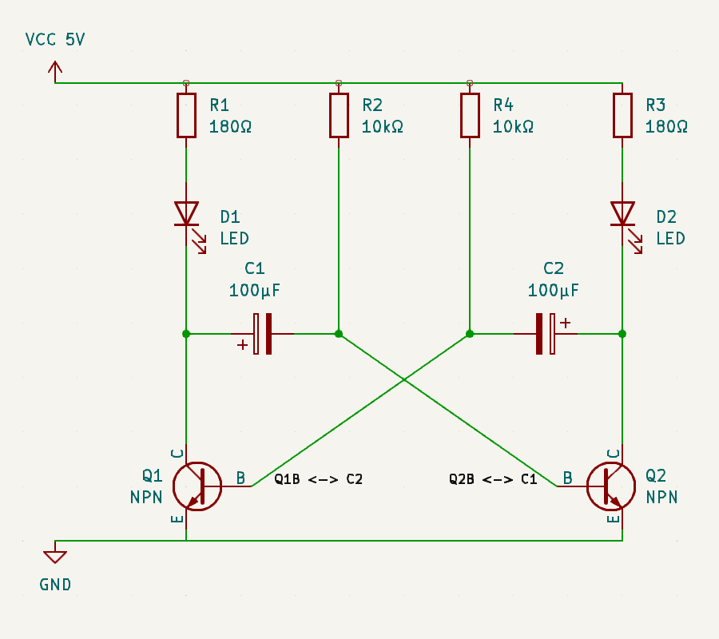
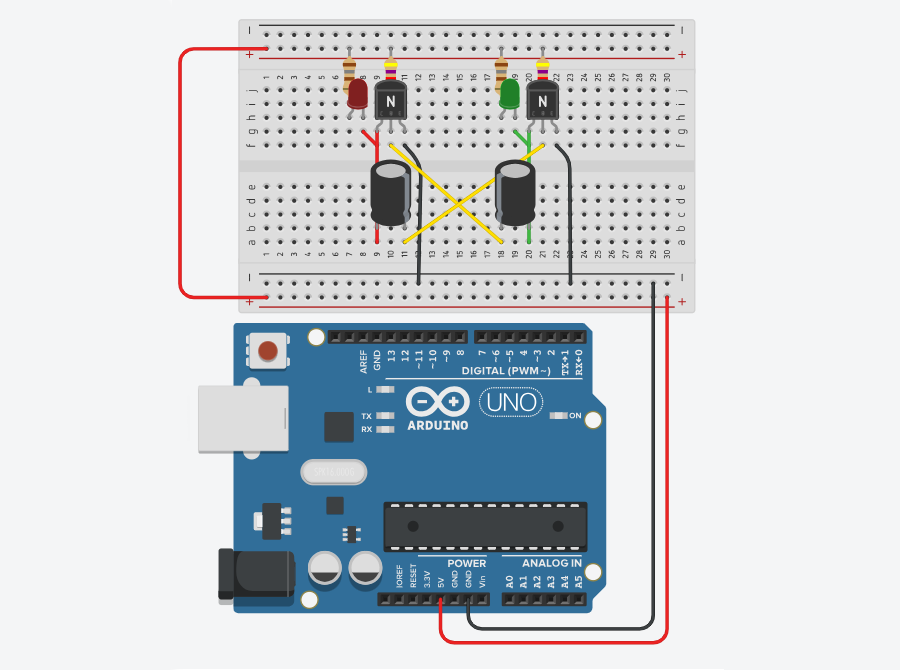

# Astable Multivibrator Circuit

## Overview
An astable multivibrator is an electronic circuit that generates a continuous output signal in the form of a square wave
without requiring any external triggering. It is commonly used in applications requiring clock pulses, oscillators, and
timers. Unlike monostable and bistable multivibrators, the astable multivibrator does not have a stable state;
it continuously switches between two unstable states, producing a periodic output.

## Circuit Components

1. 180Ω Resistor (2x)
2. 10kΩ Resistor (2x or 4x in series to achieve 20k)
3. Red LED, 5mm
4. Green LED, 5mm
5. 10µF Electrolytic Capacitors (2x)
6. 100µF Electrolytic Capacitors (2x)
7. 1000µF Electrolytic Capacitors (2x)
8. BC547 Transistor (2x)
9. Wires to connect the circuit

## Circuit Schematic

## Visual Diagram:

## Working Principle
The operation of the astable multivibrator can be understood in a series of steps, focusing on the charging and
discharging cycles of the capacitors which drive the transistor switches.

### 1. Initial State
* Theoretically, both transistors should turn ON simultaneously as they are connected
through resistors and capacitors of equal value, however, in practice, these components hold
slightly different values due to their nature, so one transistor will always turn ON before the other is able to.
* Assume transistor Q1 is ON (saturation state) and Q2 is OFF (cutoff state).
* Capacitor C1 starts charging through the 10kΩ resistor R2 from the power supply (5V, VCC).
* The voltage across C1 increases exponentially.

### 2. Charging Of C1
* As C1 charges, the base voltage of Q2 increases.
* Once the base-emitter voltage of Q2 exceeds its threshold (approximately 0.7V for silicon transistors), Q2 turns ON.

### 3. Switching State
* When Q2 turns ON, it rapidly pulls its collector voltage towards ground. 
* This causes capacitor C2, which was previously charged, to discharge quickly through Q2.

### 4. Discharging of C2
* The rapid discharge of C2 pulls the base of Q1 towards ground, turning Q1 OFF.
* With Q1 OFF, C1 discharges through Q2, R3, and the collector-emitter path of Q1.

### 5. Transition to Next State
* As Q1 turns OFF, the voltage at its collector (which is connected to the base of Q2 through C1) rises, turning Q2 ON.
* This cycle repeats with the roles of Q1 and Q2 interchanging, thus maintaining a continuous oscillation.

## Circuit Simulation

## Live Presentation

## Circuit calculations

### Charging Time (T_high)

T(*high*) is the time it takes for the capacitor to charge through R1, R2, and R(*led*):

T(*high*) = 0.693 × (R1+R2+R(*led*)) × C1

T(*high*) = 0.693 × (180+10000+150) × 100 * 10 −6

T(*high*) ≈ 0.709s

### Discharging Time (T_low)

T(*low*) is the time it takes for the capacitor to charge through R1, R2, and R(*led*):

T(*low*) = 0.693 × R2 × C1

T(*low*) = 0.693 × 10000 × 100 * 10 −6

T(*low*) ≈ 0.693s

### Total period (T)

The frequency (𝑓) is the reciprocal of the period 𝑇:

𝑓 = 1/T

𝑓 = 1/1.402

𝑓 ≈ 0.713Hz

### Duty Cycle (D)

The duty cycle (D) is the fraction of the period during which the output is high:

D = T(*high*)/T

D = 0.709s/1.402s

D ≈ 0.506 or 50.6%

### Summary 

* Charging time T(*high*): Approximately 0.709s
* Discharging time T(*low*): Approximately 0.693s
* Total period (T): Approximately 1.402s
* Frequency (𝑓): Approximately 0.713Hz
* Duty Cycle (D): Approximaely 50.6%